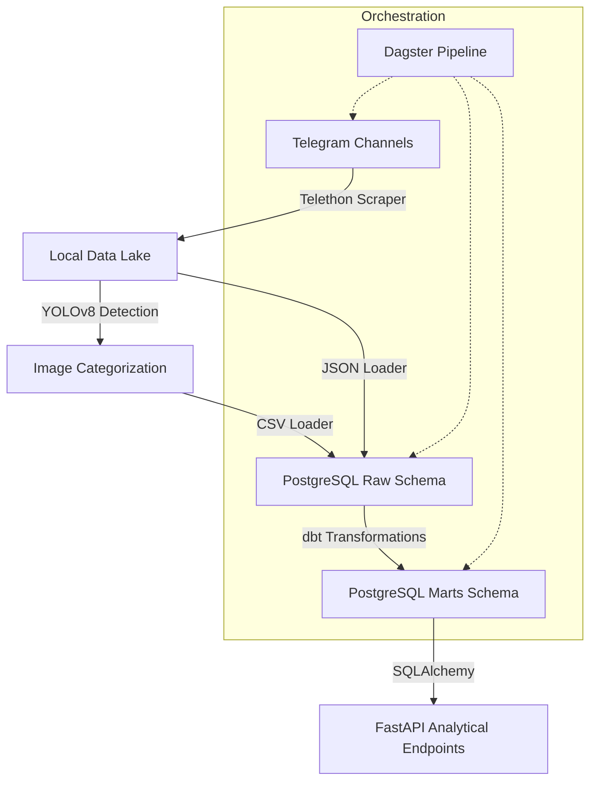

# Medical Telegram Data Warehouse


An end-to-end ELT (Extract, Load, Transform) pipeline designed to extract, process, and analyze medical and pharmaceutical data from Telegram channels in Ethiopia. This project leverages computer vision (YOLOv8) for image enrichment and serves insights through a high-performance FastAPI.


## Key Features

- **Automated Scraping**: Uses [Telethon](https://docs.telethon.dev/) to extract messages, engagement metrics, and images from targeted Telegram channels.
- **AI Enrichment**: Integrated **YOLOv8** object detection to classify images and detect products (bottles, containers, etc.) for deeper market analysis.
- **Modern Data Stack**: 
    - **Data Lake**: Local file-based storage for raw JSON and image assets.
    - **Warehouse**: PostgreSQL database with a star-schema design.
    - **Transformations**: [dbt](https://www.getdbt.com/) for modular and testable SQL modeling.
- **Analytical API**: FastAPI-powered endpoints for querying top products, channel activity, and visual content statistics.
- **Pipeline Orchestration**: [Dagster](https://dagster.io/) for automating, monitoring, and scheduling the end-to-end workflow.


## Architecture




## Project Structure

```text
medical-telegram-warehouse/
├── api/                  # FastAPI Application Layer
│   ├── main.py           # Core API & Endpoints
│   ├── models.py         # SQLAlchemy Database Models
│   ├── schemas.py        # Pydantic Validation Models
│   └── database.py       # SQL Engine Configuration
├── medical_warehouse/    # dbt Project
│   ├── models/
│   │   ├── staging/      # Data cleaning & standardization
│   │   └── marts/        # Fact & Dimension (Star Schema)
│   └── dbt_project.yml   # dbt Configuration
├── src/                  # Core Python Source
│   ├── scraper.py        # Telegram Scraper
│   ├── yolo_detect.py    # Computer Vision Enrichment
│   └── datalake.py       # Data Lake Utility
├── scripts/              # Database Loading Scripts
│   ├── load_to_postgres.py
│   └── load_yolo_to_postgres.py
├── pipeline.py           # Dagster Orchestration Definition
└── data/                 # Local Data Storage (Git Ignored)
```


## Setup & Installation

### 1. Prerequisites
- Python 3.8+
- PostgreSQL 12+
- Telegram API Credentials ([my.telegram.org](https://my.telegram.org))

### 2. Environment Configuration
Create a `.env` file in the root directory:
```env
# Database
DB_HOST=localhost
DB_PORT=5432
DB_USER=postgres
DB_PASSWORD=your_password
DB_NAME=medical_warehouse

# Telegram
TG_API_ID=your_api_id
TG_API_HASH=your_api_hash
TG_PHONE=+your_phone_number
```

### 3. Installation
```bash
python -m venv venv
source venv/bin/activate  # venv\Scripts\activate on Windows
pip install -r requirements.txt
```


## Usage

### Orchestrating the Data Pipeline
To launch the Dagster UI and manage the pipeline:
```bash
dagster dev -f pipeline.py
```
Visit `http://localhost:3000` to trigger or schedule the `medical_warehouse_pipeline` job.

### Starting the Analytical API
To serve the analytical endpoints:
```bash
python -m uvicorn api.main:app --reload
```
API Documentation is available at `http://localhost:8000/docs`.


## Testing

### Python Unit Tests
```bash
python -m unittest discover tests
```

### dbt Data Tests
```bash
cd medical_warehouse
dbt test
```

## Data Exploration
The `notebooks/` directory contains Jupyter notebooks used for initial EDA (Exploratory Data Analysis), data quality checks, and YOLOv8 model testing.

## CI/CD
Automated testing is configured via **GitHub Actions** (`.github/workflows/unittests.yml`), ensuring that every push to the repository passes the essential unit tests.

## Analytical Insights
The API exposes critical metrics for medical businesses:
- **Top Products**: Identify trending items detected in visual content.
- **Channel Activity**: Monitor posting trends and engagement (views/forwards).
- **Search**: Fast keyword-based retrieval of message history.
- **Visual Analytics**: Statistics on image-to-text ratios and categorization.


